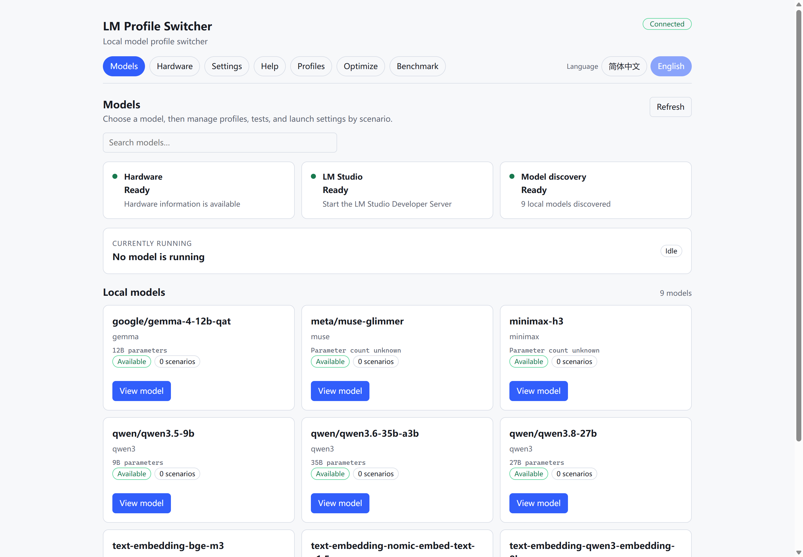
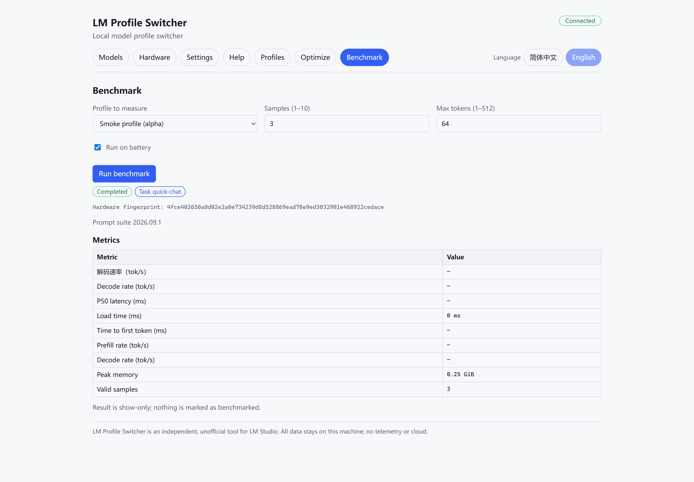
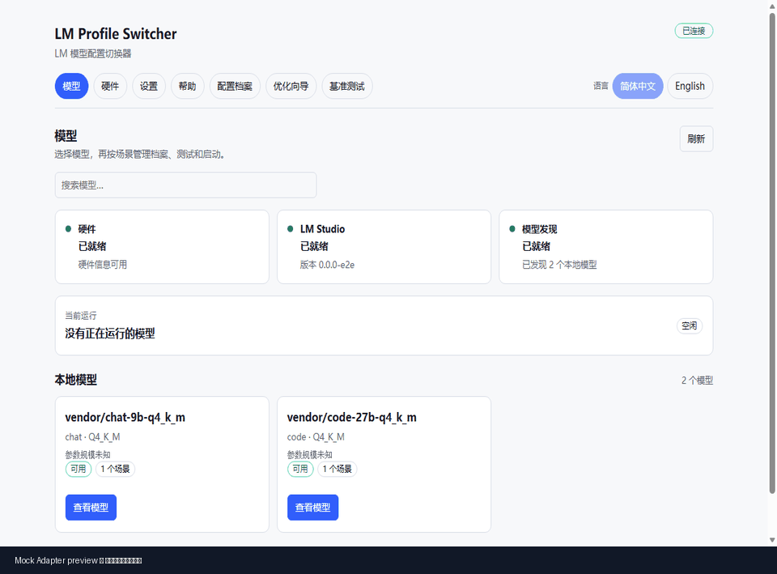

# LM Profile Switcher

[](https://github.com/lajark/LM-Profile-Switcher/actions/workflows/ci.yml)

**Hardware-aware profiles, real-machine benchmarks, and safe switching for LM Studio.**

Stop retuning LM Studio every time you switch models.
LM Profile Switcher detects your hardware, recommends reproducible configurations,
benchmarks them on your machine, and safely applies the profiles that actually work.

[简体中文](README.zh-CN.md) · [Download](https://github.com/lajark/LM-Profile-Switcher/releases) · [Contributing](CONTRIBUTING.md) · [Distribution channels](docs/DISTRIBUTION_CHANNELS.md)

> Independent, unofficial community project — not affiliated with or endorsed by LM Studio.



## Download for Windows

**Windows x86_64:** download the latest installer from
[GitHub Releases](https://github.com/lajark/LM-Profile-Switcher/releases).

Current Windows beta: **v0.2.3-beta.1** — download the installer from [GitHub Releases](https://github.com/lajark/LM-Profile-Switcher/releases).

- 100% local — no telemetry, no cloud account, no account needed
- Per-user NSIS installer (Windows 10/11)
- Ships `checksums.sha256`, `release-manifest.json`, SBOM, dependency licenses, third-party notices and release notes

> The current beta installer is **unsigned**, so Windows SmartScreen may show a warning.
> macOS is excluded from this optimization round. Historical macOS build, signing, and notarization blockers remain recorded for a future round.

## Why LM Profile Switcher?

| Problem | What LM Profile Switcher does |
|---|---|
| Every model needs different settings | Saves reusable, schema-validated profiles |
| Hardware limits are hard to estimate | Detects local hardware and recommends bounded candidates |
| Static recommendations can be wrong | Benchmarks candidates on your actual machine |
| The best configuration changes by machine | Measured results feed back into future recommendations |
| Applying settings can fail | Health-check + automatic rollback protects activation |

## How it works

**Detect → Optimize → Benchmark → Apply**

1. Detect your CPU, RAM and GPU.
2. Generate task-aware configuration candidates with an explainable score.
3. Benchmark selected profiles locally (load, TTFT, prefill, decode, peak VRAM).
4. Let measured performance refine future recommendations.
5. Apply the selected profile with health checks and rollback.




The model-first screenshot is a read-only local LM Studio session. The Benchmark screenshot is a deterministic isolated Mock Adapter preview; its values are fixture output, not a performance claim.

### Workflow preview

The GIF below is an offline Mock Adapter UI preview of the model-first flow. It demonstrates navigation, optimization, Benchmark, and application states; it does not represent LM Studio performance.



## Key features

- **Hardware-aware profiles** — GPU/VRAM/RAM-aware recommendation with a safety margin, ranked per task kind with bilingual rationale.
- **Real-machine benchmarking** — bounded, cancellable, fingerprint-bound objective benchmarks that restore the previous model afterwards.
- **Measured-feedback loop** — configurations benchmarked on your host are promoted above unmeasured ones and ranked by real decode throughput.
- **Safe activation** — one shared transaction (health check + automatic rollback) for the CLI, tray, hook, proxy and Benchmark.
- **Local automation (loopback only)** — `lmps hook` (app/task-driven switching) and `lmps proxy` (OpenAI-compatible HTTP surface), both bound to `127.0.0.1` only.

## Real-machine tested

Measured in real LM Studio sessions on **RTX 5060 Ti 16 GB · Core Ultra 5 225H · 32 GB RAM · Windows 11**.

| Model class | Result |
|---|---|
| 9B, fully GPU-resident | ~63–65 tok/s decode, negligible LMPS overhead |
| 27B, near VRAM limit | Hybrid configurations generated, benchmarked and ranked |
| 35B MoE, beyond VRAM | Hybrid configurations generated, benchmarked and ranked |

[Full methodology, tables and known limitations →](docs/BENCHMARKS.md)


## Privacy & safety

- Everything runs locally — no telemetry, no cloud account, no model downloads by the tool.
- Loopback-only bindings for the hook and proxy; persistent tokens are stored as secrets and redacted from logs/audit.
- Profile writes are atomic with write-ahead backups; activation failures roll back to the previous configuration.

## Quick start

**Desktop users:** install the Windows installer from
[GitHub Releases](https://github.com/lajark/LM-Profile-Switcher/releases), launch, and it connects to your local LM Studio.

**Developers / CLI:** Node.js ≥ 20 and pnpm 10.15.0 (Corepack supported) are required.

```text
corepack pnpm install
corepack pnpm run build
corepack pnpm run lmps -- --help
corepack pnpm run lmps -- --json profile list
```

`corepack pnpm run check` runs lint, typecheck, the i18n gate, the TypeScript build, domain-schema generation + freshness, unit tests, and the compliance bundle. It needs no LM Studio connection or model download.

## CLI

`lmps` covers profiles, hardware, optimization, benchmark and safe switching with a stable machine envelope (`--json`) and bilingual output. See [docs/CLI_SPEC.md](docs/CLI_SPEC.md) for the full contract and exit codes.

## Advanced automation

- `lmps hook` — app/task-driven model switching with persistent token auth and deny-by-default rules.
- `lmps proxy` — an OpenAI-compatible surface (`GET /v1/models`, `POST /v1/chat/completions`) mapping virtual model names to profiles, with per-session locking and explicit opt-in activation. Both bind to `127.0.0.1` only.

## Reliability under the hood

- **Schema-validated contracts** — versioned `HardwareProfile` / `ModelProfile` / `TaskProfile` / `RuntimeProfile` / `GenerationProfile` / `BehaviorProfile` documents, persisted as plain JSON/YAML under `LMPS_HOME` (default `~/.lmps`).
- **Atomic writes + write-ahead backups** — every profile write is temp + fsync + atomic rename, with rotating backups and startup recovery.
- **One activation lock** — CLI, tray, Benchmark, hook and proxy serialize through the same cross-process `activation.lock` with crash-residue reclaim.
- **Governed distribution** — `policy:scan` (structural policy + secret scan) gates every commit, release staging and CI; provenance, dependency licenses, CycloneDX SBOM and third-party notices are generated and checked.

## Documentation

- `docs/ARCHITECTURE.md` — modules, processes, and adapter design
- `docs/CLI_SPEC.md` — `lmps` command contract, machine envelope, and exit codes
- `docs/SECURITY.md` — threat model, secrets handling, loopback-only binding
- `docs/BENCHMARKS.md` — real-machine benchmark methodology and results
- `docs/OPEN_SOURCE_REUSE_POLICY.md` — provenance and license rules for borrowed code
- `docs/TRACEABILITY_MATRIX.md` — requirement–task–test tracing
- `PROJECT_DISTRIBUTION_POLICY.md` — file classification and release boundary
- `AGENTS.md` — project instructions and verified commands

## Repository layout

```text
apps/cli                 lmps CLI (thin entry point)
apps/core-service        local sidecar: stdio/pipe/loopback-HTTP IPC, hook and proxy planes
apps/desktop             Tauri 2 shell + React/Web GUI and system tray
packages/benchmark       bounded objective benchmarking
packages/core            use cases, state machines, business rules
packages/domain          pure domain contracts + generated JSON Schemas
packages/hardware        local hardware probing
packages/i18n            locale resources and type-safe keys
packages/lmstudio-adapter  every LM Studio call (SDK / REST v1 / lms CLI) behind one boundary
packages/optimizer       data-driven, bounded candidate generation
packages/profile-store   atomic storage, backups, migrations, import/export
scripts/                 policy scan, release assembly, install verification
```

## Contributing

Please read [CONTRIBUTING.md](CONTRIBUTING.md) first, use the
[issue templates](https://github.com/lajark/LM-Profile-Switcher/issues/new/choose)
for bugs and feature requests, and follow the PR template. Security issues:
use GitHub private vulnerability reporting (see [SECURITY](https://github.com/lajark/LM-Profile-Switcher/security/policy)).

## License

MIT — see [LICENSE](LICENSE).

> LM Profile Switcher is an independent, unofficial community tool and is not affiliated with or endorsed by LM Studio.
