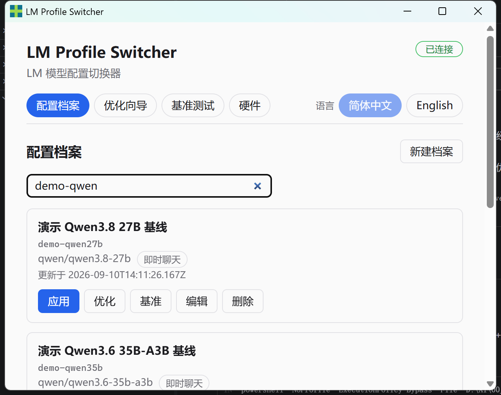
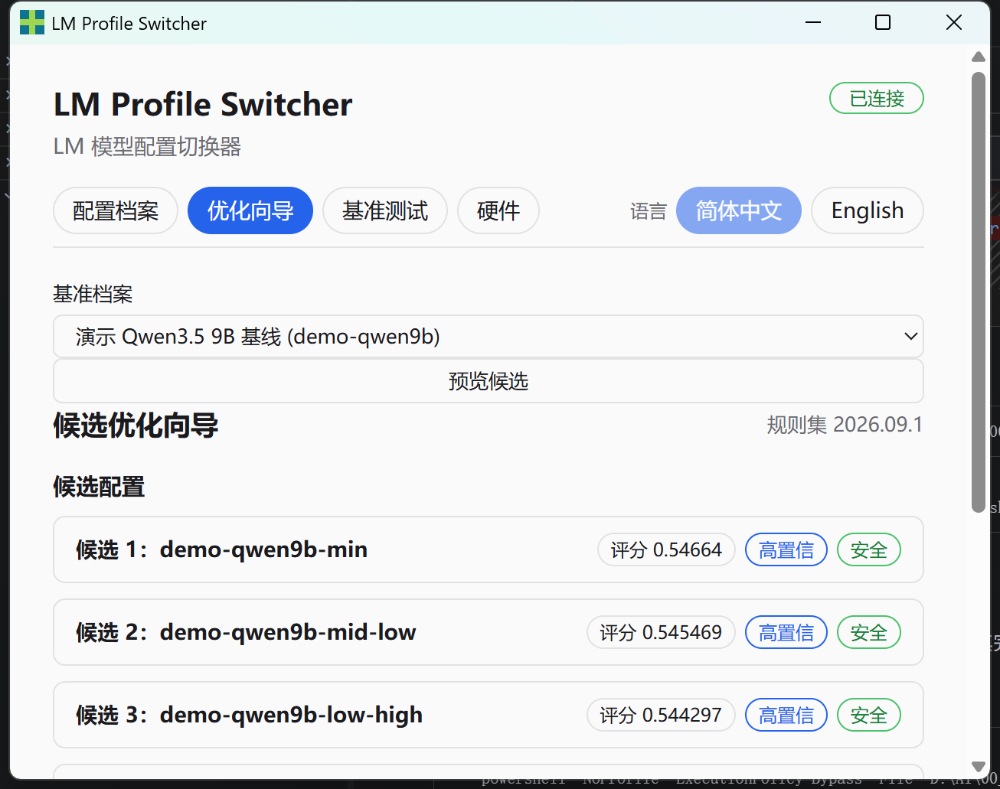
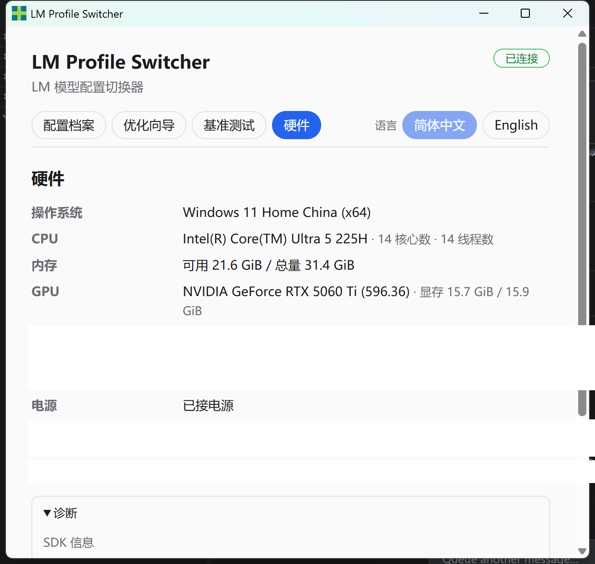

# LM Profile Switcher

[](https://github.com/lajark/LM-Profile-Switcher/actions/workflows/ci.yml)

**面向 LM Studio 的硬件感知 Profile 管理：自动识别硬件、推荐配置、实机测试并安全切换。**

别再为切换模型而反复手工调参。
LM Profile Switcher 自动识别你的硬件，推荐可复现的配置，在本机实测校准，并安全应用真正有效的 Profile。

[English](README.md) · [下载](https://github.com/lajark/LM-Profile-Switcher/releases) · [贡献指南](CONTRIBUTING.md) · [分发渠道](docs/DISTRIBUTION_CHANNELS.md)

> 独立、非官方的社区项目——与 LM Studio 官方不存在隶属、合作或背书关系。



## 下载 Windows 版

**Windows x86_64**：从 [GitHub Releases](https://github.com/lajark/LM-Profile-Switcher/releases) 下载最新安装包。

当前公开 Beta：`v0.2.0-beta.1`

- 100% 本地运行——无遥测、无云账号、无需登录
- 按当前用户安装（NSIS，Windows 10/11）
- 随包提供 `checksums.sha256`、`release-manifest.json`、SBOM、依赖许可证、第三方声明与发布说明

> 当前 Beta 安装包**未签名**，Windows SmartScreen 可能显示警告。
> macOS 分发仍阻塞（无构建硬件 / Apple 凭据）。

## 为什么需要 LM Profile Switcher？

| 痛点 | 它能做什么 |
|---|---|
| 不同模型需要不同参数 | 保存可复用、经 Schema 校验的 Profile |
| 硬件上限难以估算 | 探测本机硬件并推荐有界候选 |
| 静态推荐可能不准 | 在你的真实机器上实测候选 |
| 最优配置因机器而异 | 实测结果回流到后续推荐 |
| 应用配置可能失败 | 健康检查 + 自动回滚保护激活 |

## 工作方式

**识别 → 优化 → 实测 → 应用**

1. 识别你的 CPU、内存与 GPU。
2. 生成带可解释评分的任务感知候选配置。
3. 本地实测候选（加载 / TTFT / Prefill / Decode / 峰值显存）。
4. 让实测性能优化后续推荐。
5. 带健康检查与回滚地应用所选配置。



## 核心能力

- **硬件感知 Profile**：带显存安全余量的 GPU/VRAM/RAM 感知推荐，按任务类别排序并附中英双语理由。
- **真机 Benchmark**：有界、可取消、绑定机器指纹的客观基准，结束后自动恢复原模型。
- **实测回流闭环**：本机实测过的配置会被提升到未实测候选之前，并按真实 decode 吞吐排序。
- **安全激活**：CLI、托盘、Hook、Proxy 与 Benchmark 共用同一事务（健康检查 + 自动回滚）。
- **本机自动化（仅回环）**：`lmps hook`（按应用/任务切换）与 `lmps proxy`（OpenAI 兼容 HTTP 面），均只绑定 `127.0.0.1`。

## 真机实测

实测于真实 LM Studio 会话：**RTX 5060 Ti 16 GB · Core Ultra 5 225H · 32 GB 内存 · Windows 11**。

| 模型类别 | 结果 |
|---|---|
| 9B，全量驻留 GPU | decode ~63–65 tok/s，LMPS 自身开销可忽略 |
| 27B，临近显存上限 | 生成、实测并排序 Hybrid 配置 |
| 35B MoE，超出显存 | 生成、实测并排序 Hybrid 配置 |

[完整方法学、数据表与已知限制 →](docs/BENCHMARKS.md)



## 隐私与安全

- 全程本地运行——无遥测、无云账号、工具不下载模型。
- Hook/Proxy 仅回环绑定；持久化 token 按 Secret 处理并从日志/审计中脱敏。
- Profile 写入为原子写 + 写前备份；激活失败自动回滚到先前配置。

## 快速开始

**桌面用户**：从 [GitHub Releases](https://github.com/lajark/LM-Profile-Switcher/releases) 安装 Windows 安装包，启动后连接本地 LM Studio 即可。

**开发者 / CLI**：需要 Node.js ≥ 20 与 pnpm 10.15.0（支持 Corepack）。

```text
corepack pnpm install
corepack pnpm run build
corepack pnpm run lmps -- --help
corepack pnpm run lmps -- --json profile list
```

`corepack pnpm run check` 依次运行 Lint、类型检查、i18n 门禁、TypeScript 构建、领域 Schema 生成与时效门禁、单元测试与合规汇总；无需连接 LM Studio 或下载模型。

## CLI

`lmps` 覆盖 Profile、硬件、优化、Benchmark 与安全切换，提供稳定机器信封（`--json`）与双语输出。完整契约与退出码见 [docs/CLI_SPEC.md](docs/CLI_SPEC.md)。

## 进阶自动化

- `lmps hook`——按应用/任务驱动的模型切换，持久化 token 认证，默认拒绝（deny-by-default）。
- `lmps proxy`——OpenAI 兼容 HTTP 面（`GET /v1/models`、`POST /v1/chat/completions`），把虚拟模型名映射到 Profile，支持会话锁定与显式 opt-in 激活。两者均只绑定 `127.0.0.1`。

## 工程可信度（Reliability under the hood）

- **Schema 校验的契约**：版本化的 `HardwareProfile` / `ModelProfile` / `TaskProfile` / `RuntimeProfile` / `GenerationProfile` / `BehaviorProfile` 文档，以纯 JSON/YAML 持久化在 `LMPS_HOME`（缺省 `~/.lmps`）。
- **原子写入 + 写前备份**：每次 Profile 写入均为 temp + fsync + 原子 rename，带轮转备份与启动恢复。
- **同一把激活锁**：CLI、托盘、Benchmark、Hook 与 Proxy 经同一个跨进程 `activation.lock` 串行化，支持崩溃残留回收。
- **受治理的分发**：`policy:scan`（结构性策略 + Secret 扫描）守门每一次提交、发布暂存与 CI；Provenance、依赖许可证、CycloneDX SBOM 与第三方声明均生成并校验。

## 文档

- `docs/ARCHITECTURE.md` — 模块、进程与 Adapter 设计
- `docs/CLI_SPEC.md` — `lmps` 命令契约、机器信封与退出码
- `docs/SECURITY.md` — 威胁模型、Secret 处理与回环绑定策略
- `docs/BENCHMARKS.md` — 真机 Benchmark 方法学与结果
- `docs/OPEN_SOURCE_REUSE_POLICY.md` — 借用代码的来源与许可证规则
- `docs/TRACEABILITY_MATRIX.md` — 需求—任务—测试追踪
- `PROJECT_DISTRIBUTION_POLICY.md` — 文件分类与发布边界
- `AGENTS.md` — 项目规则与已验证命令

## 仓库布局

```text
apps/cli                 lmps CLI（薄入口）
apps/core-service        本地 sidecar：stdio/管道/回环 HTTP IPC、Hook 与 Proxy 面
apps/desktop             Tauri 2 壳 + React/Web GUI 与系统托盘
packages/benchmark       有界客观基准
packages/core            用例编排、状态机与业务规则
packages/domain          纯领域契约 + 生成的 JSON Schema
packages/hardware        本机硬件探测
packages/i18n            语言资源与类型安全 key
packages/lmstudio-adapter  所有 LM Studio 调用（SDK / REST v1 / lms CLI）统一在一个边界之后
packages/optimizer       数据驱动、有界的候选生成
packages/profile-store   原子存储、备份、迁移、导入导出
scripts/                 策略扫描、发布组装、安装验证
```

## 贡献

请先阅读 [CONTRIBUTING.md](CONTRIBUTING.md)，使用
[Issue 模板](https://github.com/lajark/LM-Profile-Switcher/issues/new/choose)
提交缺陷与功能建议，并遵循 PR 模板。安全问题请走 GitHub 私有漏洞报告（见 [安全策略](https://github.com/lajark/LM-Profile-Switcher/security/policy)）。

## 许可证

MIT — 见 [LICENSE](LICENSE)。

> LM Profile Switcher 是独立、非官方的社区工具，与 LM Studio 官方不存在隶属、合作或背书关系。
